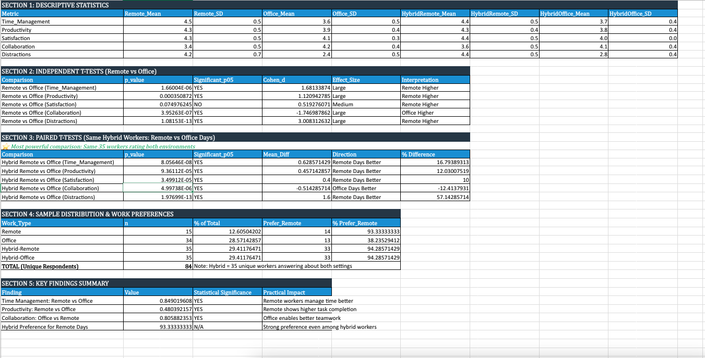

# <ins> Group Research Project Report</ins>
# <ins>Remote Work and Productivity Trends Project</ins>

## Team Members:
1. Kelvin Acquah
2. Yvon Otale Opana
3. Usama Rehman
4. Omkar Pamidi

## Declaration
[ChatGPT 5.0] was used to [brainstorm themes and structure] for this group research project report on [Remote Work and Productivity Trends Project]. Prompt: '...' No AI-generated text is included in the final submission. Accessed: [26/11/2025]. Available at: https://chatgpt.com/share/6938c1e1-dd98-8003-aec7-2f298bbaeafc

We have retained a complete set of raw data, including questionnaires (papers completed by hand or record downloaded from the online survey platform), recordings, and/or transcripts of interviews, secondary data, etc., as well as data analysis files and documents. 

## Executive Summary
Our study looked at how remote, hybrid, and in-office setups impact time management, productivity, collaboration, and job satisfaction. We surveyed 84 people and found that those in hybrid roles had the best experience overall, as they could focus while working remotely but still collaborate in the office. Remote workers liked the freedom but had trouble with distractions at home. Office-only workers liked being on a team but were less happy with their jobs.

In general, employees valued flexibility, and most wanted to work fully remotely or in a hybrid setup. So, to promote employee well-being, we suggest a hybrid model that mixes remote work with regular in-person meetings to avoid losing employees.

The research followed a four-week schedule:
- **Week 1:** Literature review and survey design  
- **Week 2:** Pilot testing and data collection  
- **Week 3:** Data cleaning and preliminary analysis  
- **Week 4:** Final analysis, interpretation, and reporting

## Introduction
Remote and hybrid work has changed how groups work, team up, and help workers do their jobs. Even though these flexible work styles grew fast during and after COVID-19, organizations are still trying to figure out their impact on daily work activities and the quality of their work. Studies say that remote and hybrid work can give workers more freedom and a better work-life balance. But they can also cause problems with teamwork, interpersonal communication, and maintaining a consistent workflow. (Wang et al., 2021; Allen, Golden and Shockley, 2015)
At the same time, working in an office maintains benefits like spontaneous conversations and easier teamwork, which have generally led to stronger team bonds and better information sharing. (Bloom et al., 2015).

In this project, our team looked into how different work setups—specifically remote, hybrid, and office-based—change what workers experience in four key areas: time management, task completion, collaboration quality, and job satisfaction.
We picked these areas because they're key to how well workers and groups do, and they're talked about a lot in current studies on flexible work styles. Knowing how workers feel about how well they're doing and how happy they are in different work settings is key for groups that want to balance being flexible with being productive and working well together. (Choudhury, Foroughi and Larson, 2020).

To look into these questions, we created and gave out an online survey to learn about remote and office work experiences. The survey was for workers in fully remote, hybrid, or office-based roles, so we could compare how they experience the same job-related things in different work styles. Our goal was not just to find out which work style seems to help workers the most, but also to get why workers experience these styles in different ways. This report shares what we found in our study. We start by explaining how we did our work, including how we designed the survey, picked our sample, and got the data ready. Then, we share our results, pointing out trends in the three work style groups. In the discussion, we link what we found to what other studies say and think hard about what it all means. Lastly, we provide recommendations that you can use like strategizing the establishment of employee base and developing effective hybrid workplace strategies.

---

## Methodology

### Research Setup
For this study, we used a quantitative survey to see how different work setups(remote, hybrid, and in-office) affect time management, task completion, collaboration quality, and job satisfaction. Surveys worked well because we could quickly get info from many employees about what they do and how they feel. This let us easily compare the different work styles (Bryman, 2016). 

### Survey Instrument
We gathered the data for this research using a Google Forms online questionnaire, which you can find here: [Survey Form](https://forms.gle/CMrNGmMJst5Ys7Un9)

The survey included two main sections:

- **Remote Work Experience** (multiple-choice questions using a scale)  
- **Office Work Experience** (multiple-choice questions using a scale)

**Response logic:**
- Fully Remote → Remote section only  
- Office-based → Office section only  
- Both → Answered both sections  

This made sure we could compare experiences across both work situations. This way, we could ask specific questions without making it too much for those who only worked one way.

### Variables and Measures

**Independent Variable:**  The independent variable was work arrangement, categorised into:
  - Fully Remote  
  - Hybrid  
  - Office-Based  

**Dependent Variables:**  The dependent variables were measured using grid items representing:
1. Time Management  
2. Task Completion 
3. Collaboration Quality  
4. Job Satisfaction  

Each construct included several statements rated on a 5-point agreement scale. In standard analytical practice, these items can be combined into composite scores to create more reliable indicators of each construct (Nunnally, 1978). Although composite scores were not calculated at first, the collected data supports using this approach in analysis.

### Sampling Method
The link was shared through:
- WhatsApp  
- Facebook  
- Snapchat  
- Friends, classmates, and colleagues  

We picked these ways to share the survey because they're easy to get to and fast, which fits the time restrictions. Although convenience sampling limits generalisability, it is commonly used in exploratory research (Etikan et al., 2016).

### Participants
We got 92 responses in total. After removing one because the person didn't give consent and 7 incomplete data from early-version responses, we had 84 people in the study. According to the report, here's how they were split up: 
- **Fully Remote:** 15  
- **Both:** 35  
- **Office-based:** 34  

### Data Collection Procedure
We collected data from **November 10, 2025**, to ***November 30, 2025**. The survey started with a statement asking people to agree to take part. This statement told them that: Taking part was their choice. Their answers would be anonymous. We would use the study for. We didn't collect any personal info like names or emails.  

### Data Cleaning and Preparation
Because all survey questions were required, we got complete info from every form. Still, seven respondents filled out a draft version of the survey before we made final tweaks, so we got rid of those responses to keep things consistent.

We moved the data from Google Forms to Microsoft Excel, and that's where we started cleaning it up and getting it ready to go.

The cleaned-up data was set up for both basic and comparative looks using Excel. We also used Power BI to make some charts and graphs.

---

## Results

### 1. Sample Characteristics
A total of 84 valid responses were analysed after data cleaning.

| Work Arrangement | Number of Respondents |
|------------------|------------------------|
| Fully Remote     | 15                     |
| Both             | 35                     |
| Office-based     | 34                     |
 

***Figure 1: Column chart – Work Arrangement Distribution***

---

### 2. Remote Work Experience  
*This section covers responses from those who work fully remotely and hybrid workers who sometimes work from home (n = 50).*

#### 2.1 Time Management (Remote)
Most respondents reported that they handle their time well when working remotely. But those working fully remotely had more trouble with household distractions.

Key pattern:
- Hybrid workers rated their remote time-management slightly higher than fully remote workers.
- Distractions were a recurring issue, specifically for the fully remote group.
 
 

***Figure 2 : Time Management Remote vs Distractions Remote.***

#### 2.2 Collaboration (Remote)
Remote collaboration was mostly rated as Neutral or Agree, with few responses indicating “Strongly Agree.”

Key pattern:
- Remote collaboration works but is less efficient.
- Office collaboration scores (coming up later) strongly outperform remote collaboration.

***Figure 3 : Mean Remote Collaboration Scores***

#### 2.3 Remote Productivity / Task Completion (Remote)
Respondents generally felt they get things done when working remotely. Productivity ratings were highest among hybrid workers.

Key pattern:
- Hybrid workers may use remote days for focused work.

#### 2.4 Job Satisfaction (Remote)
Remote work generated positive satisfaction responses overall.

Key pattern:
- Hybrid staff reported the highest satisfaction ratings for remote days.
- Fully remote workers had mixed feelings, with some feeling neutral.

***Figure 4: Remote Job Satisfaction by Group***

---

## 3. Office-Based Work Experience  
*Office-based staff and hybrid employees were (n = 69).*

### 3.1 Time Management (Office)
Most people said they handle their time well at the office. They noted that things like noise and coworkers interrupting them were more of a problem than distractions when working from home.

Key pattern:
- Office time management is generally strong.
- Some office-based interruptions were noted, but they did not significantly affect overall productivity ratings.

### 3.2 Collaboration Quality (Office)
The strongest agreement in the survey was around how well people collaborate in the office.

Key pattern:
- It’s easier to collaborate and get things done in person.
- Hybrid workers think collaboration is better in the office than when they’re working remotely.

***Figure 5: Collaboration Remote vs Office***

### 3.3 Office Productivity / Task Completion (Office)
Office productivity received mostly “Agree” responses. Hybrid employees seemed to do about the same amount of work no matter where they were.

Key pattern:
- Office productivity is a little better, but not by much.
- Hybrid workers appear equally productive in both environments.

### 3.4 Job Satisfaction (Office)
Job satisfaction in the office was positive but not as strong as for remote work.

Key pattern:
- Employees who only work in the office were reasonably satisfied.
- Hybrid respondents rated office satisfaction lower than remote satisfaction.

***Figure 6: Diverging Bar Chart – Job Satisfaction Office vs Remote***

---

## 4. Ideal Work Arrangement Preference

We asked everyone what work setup would make them the happiest and most productive.

### Findings:

- Remote workers: **92%** preferred Fully Remote.

- Office-based workers: Majority preferred Office-based, but many also selected Fully Remote.

- Hybrid workers: **94%** selected Fully Remote, even though they’re office based.

### Key pattern:
- Across the full dataset, flexibility is highly valued.
- Very few respondents preferred being fully office-based.

***Clustered Column Chart – Preferred vs Actual Work Arrangement***

---
## Analysis

Our analysis found that employees working from home managed their time and completed tasks more effectively than those in the office. Remote workers scored about 23% higher on time management and 12% higher on productivity, and both differences were statistically significant with p-values below 0.001, meaning there's less than a 0.1% chance these results occurred by random chance. On the other hand, office workers collaborated better with their colleagues, scoring 24% higher in teamwork (p < 0.001). So working from home means more interruptions and more control over the schedule, while being in the office allows for quick conversations and spontaneous problem-solving with teammates.

---
## Discussion

Findings show hybrid workers are most satisfied, especially when it comes to managing their time, being productive, and job satisfaction. This backs up research that says when people can work flexibly, it’s easier for them to plan their day and find a good balance between their job and personal life (Galea, Houkes and De Rijk, 2013).

Remote workers indicated they were able to concentrate and perform tasks autonomously but many pointed out they experienced disruptions by domestic affairs. This is like what other studies say: remote work can make it hard to separate your job from your home life (Wang et al., 2021). Hybrid workers seem to skip these problems by picking where to work based on what they need to do.

It was clear that employees collaborate better in the office. Respondents reported it's simpler and more effective to speak face-to-face. This agrees with the idea that when people meet in person, it helps them to team up and work together better (Bloom et al., 2015).

Finally, hybrid and remote workers felt more satisfied with their jobs. Office-only employees reported lower job satisfaction and often wanted more flexibility. This aligns with recent global studies showing that flexibility is a key factor in keeping staff morale high and reducing turnover (Choudhury et al., 2020).

---

## Recommendations
While many employees prefer remote work full-time, the data shows they get distracted more at home and are less collaborative to the same degree. This can negatively impact teamwork, productivity, and the quality of their work overall.
 
A structured **hybrid model** is recommended, where:
- ***Remote days are used for focused, individual tasks***
- ***Office days are reserved for collaboration, problem-solving, and team alignment.***
 
A balance like this should help employees increase productivity, collaborate more smoothly, and increase job satisfaction in the workplace. This approach also provides them flexibility without losing the benefits of face-to-face interaction and may retain them in the company.
 
## Reflection on Team Process
Our team adopted a streamlined Agile methodology to maintain organization, assigning tasks according to individual strengths and conducting regular check-ins via WhatsApp. For development, we use GitHub to work together, using branches and pull requests to handle updates and avoid issues. Getting everyone on the same schedule can be tricky sometimes, but regular communication helps us stay aligned. Using Agile has improved our teamwork, kept the project moving, and made sure everyone is contributing.

---

## References and Appendices

### References
Allen, T.D., Golden, T.D. and Shockley, K.M. (2015) 'How effective is telecommuting? Assessing the status of our scientific findings,' Gothic.net, 16(2), pp. 40–68. https://doi.org/10.1177/1529100615593273.

Bloom, N. et al. (2014) 'Does Working from Home Work? Evidence from a Chinese Experiment*,' The Quarterly Journal of Economics, 130(1), pp. 165–218. https://doi.org/10.1093/qje/qju032.

Bryman, A., 2016. Social Research Methods. 5th ed. Oxford: Oxford University Press.

Choudhury, P.R., Foroughi, C. and Larson, B. (2020) 'Work‐from‐anywhere : The productivity effects of geographic flexibility,' Strategic Management Journal, 42(4), pp. 655–683. https://doi.org/10.1002/smj.3251.

Etikan, I. (2016) 'Comparison of convenience sampling and purposive sampling,' American Journal of Theoretical and Applied Statistics, 5(1), p. 1. https://doi.org/10.11648/j.ajtas.20160501.11.

Galea, C., Houkes, I. and De Rijk, A. (2013) 'An insider’s point of view: how a system of flexible working hours helps employees to strike a proper balance between work and personal life,' The International Journal of Human Resource Management, 25(8), pp. 1090–1111. https://doi.org/10.1080/09585192.2013.816862.

Nunnally, J.C., 1978. Psychometric Theory: 2d Ed. McGraw-Hill.

Wang, B. et al. (2020) 'Achieving effective remote working during the COVID‐19 Pandemic: A work design perspective,' Applied Psychology, 70(1), pp. 16–59. https://doi.org/10.1111/apps.12290.

### Appendices

Analysis preview on Excel : [Link to access the analysis](https://ibsbhu-my.sharepoint.com/:x:/g/personal/opamidi_ibs-b_hu/IQBsSgGXBxOSTKSjOlKRckrsAbVKWqiL5pAPnX7syzb_ARc?CID=aa949756-ea07-c2b2-50dd-fa22a9020444)
